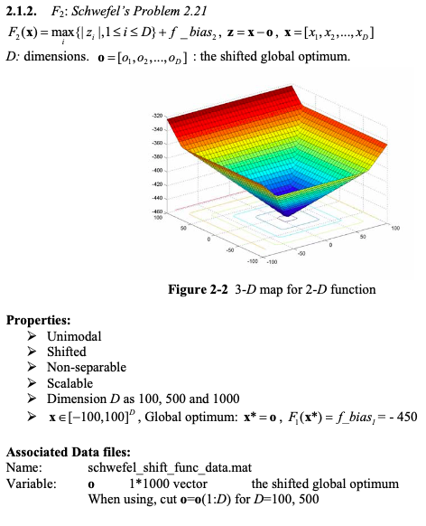

# Continuous optimization: Shifted Schwefel's Function

## Definition of the Function

## Solution

I used the Particle Swarm Optimzation algorithm as in general it works well for continuous optimization problems and can search very large spaces of candidate solutions.

### Dimension 50

1. Chosen Algorithm: Particle Swarm Optimzation from pygmo

2. Best Parameters  
* Search Space = [-100, 100]  
* Bias = -450  
* Population (Particle Swarm size):  100
* Omega (inertia factor):  0.6
* eta1 (social component):  1
* eta2 (cognitive component):  3
* Maximum allowed particle velocity:  0.6
	
3. Results
* Solution: 
>  	[  2.07146334  -7.09036583 -56.45810788 -97.64203387  -4.51376283
   -48.29543848  -1.98130905 -83.60351714 -74.20433786 -63.00528048
   -60.85014426 -54.7200589   -2.54509636 -26.64702254 -88.29263814
   -57.4698485  -48.26019203 -45.5183427  -76.77703296 -75.24139582
   -50.1273526  -79.54191271 -63.1155919  -57.89572572  -7.52380087
   -29.4052608  -24.13928642 -72.68882483 -52.95725676 -46.17708897
   -72.44339744 -72.16701849 -51.04180411 -60.55738383 -96.91048076
   -82.98175719 -97.4332498  -55.15329957 -57.69084736 -61.67771379
    -5.72786962 -69.69367485 -19.28751659 -49.19202405  -3.0667256
   -81.87778972 -14.6115781  -67.74776232 -34.86121886 -85.59605272]
* Fitness: -447.36

4. Stopping Criterion = Number of generations: 1000
5. Computational Time:  2.96  seconds

### Dimension 500
