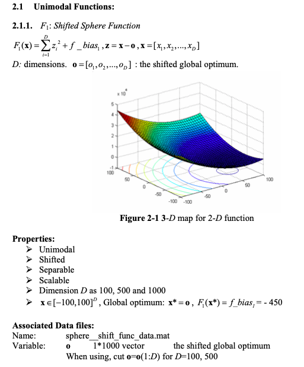

# Continuous optimization: Shifted Sphere Function

## Definition of the Function

## Solution

I used the Particle Swarm Optimzation algorithm as in general it works well for continuous optimization problems and can search very large spaces of candidate solutions.

### Dimension 50

1. Chosen Algorithm: Particle Swarm Optimzation from pygmo

2. Best Parameters  
* Search Space = [-100, 100]  
* Bias = -450  
* Population (Particle Swarm size):  100
* Omega (inertia factor):  0.6
* eta1 (social component):  2
* eta2 (cognitive component):  2
* Maximum allowed particle velocity:  0.6
	
3. Results
* Solution: 
>  	[ 97.24993593  77.06098507 -19.03114882  25.42869803 -22.90880262
	  69.57217579   5.36971395  61.48073072 -21.30069852  92.34681338
	 -93.97588121  90.74598676  42.87698029  29.30964627 -10.66954841
	 -65.0746178   67.04941633  94.01877029 -73.00502019 -49.80219854
	  82.00142499  35.29318277  24.63214921   2.44313745 -99.3034509
	 -54.62233879  95.69145813  72.25048085 -97.12295522  -2.84462699
	 -16.71940701  54.58048361  -2.37049342   4.51291379  56.40988588
	  18.24586958 -74.72144479 -78.05614656  32.58107757  99.41862299
	 -30.76381164 -64.78909695 -86.42220775 -38.12082267 -33.04804039
	 -24.76648648  90.44136626  43.86410228  55.86848706  23.53173224]
* Fitness: -450.0

4. Stopping Criterion = Number of generations: 1000
5. Computational Time:  2.9  seconds

### Dimension 500
