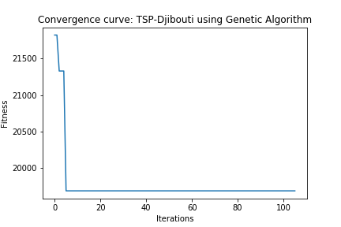
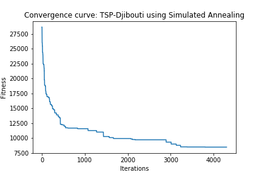

# Discrete optimization: Travelling Salesman Problem - Djibouti (38 Cities)

## Problem Description

38 Cities in Djibouti, derived from data from the National Imagery and Mapping Agency database of geographic feature names.[Link](http://www.math.uwaterloo.ca/tsp/world/djpoints.html)

## Solution

### Genetic Algorithm
1. Chosen Algorithm: Genetic Algorithm from mlrose

2. Parameters tested
* **Population**: [100, 500, 1000]
* **Mutation probability**:  [0.01,0.1,0.5]

3. Best Parameters  
* **Population**: 1000
* **Mutation probability**:  0.1
* **Max Attempts** (to find a better state at each step): 100
	
4. Results
* **Solution** (Order of city traversal by index): 
> [31, 23, 27, 29, 28, 18, 10, 8, 0, 14, 11, 6, 1, 2, 16, 12, 5, 24, 9, 13, 17, 34, 36, 22, 25, 19, 3, 15, 4, 7, 20, 26, 33, 32, 35, 30, 37, 21]
* **Fitness**: 19690.15

5. **Stopping Criterion** = Max Iterations of the algorithm: 1000
6. **Computational Time**:  130.59  seconds
7. **Convergence Curve**

### Simulated Annealing
1. Chosen Algorithm: Genetic Algorithm from mlrose

2. Parameters tested
* **Cooling Schedule** = [Exponential, Arithmetic]
* **Initial Temperature** = [10,100,1000]
* **Min Temperature** = [1,10,100]
* **Decay rate** = [0.001,0.01,0.1]

3. Best Parameters  
* **Cooling Schedule**:  Exponential
* **Initial Temperature**:  10
* **Min Temperature**:  1
* **Decay rate**:  0.1
* **Max Attempts** (to find a better neighbor at each step): 500
	
4. Results
* **Solution** (Order of city traversal by index): 
> [9, 0, 1, 3, 10, 11, 17, 27, 26, 30, 35, 33, 32, 37, 36, 34, 31, 29, 25, 24, 19, 5, 2, 4, 6, 7, 8, 15, 16, 18, 23, 21, 12, 14, 22, 28, 20, 13]
* **Fitness**: 8494.71

5. **Stopping Criterion** = Max Iterations of the algorithm: 5000
6. **Computational Time**:  2.6  seconds
7. **Convergence Curve**

