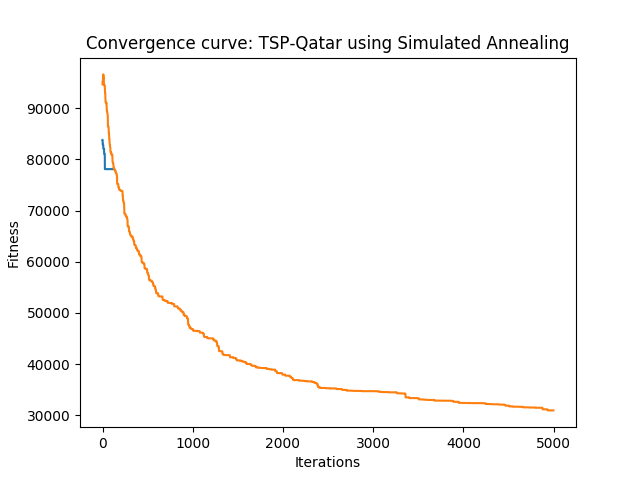

# Discrete optimization: Travelling Salesman Problem - Qatar (194 Cities)

## Problem Description

194 Cities in Qatar, derived from data from the National Imagery and Mapping Agency database of geographic feature names. [Link](http://www.math.uwaterloo.ca/tsp/world/qapoints.html)

## Solution

### Genetic Algorithm
1. Chosen Algorithm: Genetic Algorithm from mlrose

2. Parameters tested
* *Population*: [100, 500, 1000]
* *Mutation probability*:  [0.01,0.1,0.5]

3. Best Parameters  
* *Population*: 500
* *Mutation probability*:  0.1
* *Max Attempts* (to find a better state at each step): 100
	
4. Results
* *Solution* (Order of city traversal by index): 
> [121, 107, 14, 26, 86, 117, 134, 88, 97, 149, 105, 76, 20, 45, 3, 124, 99, 63, 119, 139, 145, 41, 28, 57, 116, 129, 43, 10, 96, 25, 73, 94, 151, 67, 59, 147, 169, 4, 27, 109, 77, 44, 173, 152, 108, 71, 81, 114, 137, 160, 70, 93, 100, 37, 148, 49, 47, 54, 162, 15, 167, 83, 102, 12, 39, 101, 132, 30, 189, 146, 174, 17, 61, 79, 13, 92, 141, 164, 133, 74, 95, 65, 123, 150, 75, 89, 85, 106, 143, 34, 60, 66, 118, 128, 72, 153, 115, 58, 130, 46, 7, 1, 68, 161, 193, 175, 188, 191, 136, 144, 127, 165, 52, 185, 190, 157, 55, 182, 112, 23, 131, 126, 166, 69, 38, 50, 177, 16, 19, 90, 40, 6, 62, 11, 168, 192, 156, 180, 125, 171, 186, 155, 80, 2, 5, 32, 42, 84, 0, 183, 87, 176, 56, 172, 187, 181, 113, 140, 22, 51, 78, 138, 184, 135, 64, 29, 31, 18, 9, 8, 24, 21, 36, 170, 33, 53, 110, 48, 178, 163, 179, 158, 91, 122, 98, 82, 111, 159, 120, 154, 35, 103, 104, 142]
* *Fitness*: 78112.88

5. *Stopping Criterion* = Max Iterations of the algorithm: 1000
6. *Computational Time*:  212.95  seconds
7. *Convergence Curve*

### Simulated Annealing
1. Chosen Algorithm: Genetic Algorithm from mlrose

2. Parameters tested
* *Cooling Schedule* = [Exponential, Arithmetic]
* *Initial Temperature* = [10,100,1000]
* *Min Temperature* = [1,10,100]
* *Decay rate* = [0.001,0.01,0.1]

3. Best Parameters  
* *Cooling Schedule*:  Exponential
* *Initial Temperature*:  1000
* *Min Temperature*:  10
* *Decay rate*:  0.1
* *Max Attempts* (to find a better neighbor at each step): 100
	
4. Results
* *Solution* (Order of city traversal by index): 
> [80, 37, 29, 57, 39, 50, 20, 17, 21, 32, 25, 58, 100,93, 0, 1, 5,13
    ,10, 74, 6, 2, 4, 27, 76, 66, 51, 47, 48, 49, 43, 42, 82, 78, 117, 141
    , 145, 95, 104, 106, 99, 94, 23, 8, 14, 31, 33, 38, 30, 53, 52, 28, 36, 56
    ,91, 150, 146, 142, 132, 123, 40, 41, 34, 81, 98, 133, 131, 129, 144, 151, 135,24
    ,12, 16, 22, 97, 62, 19, 85, 84, 137, 136, 160, 181, 163, 155, 139, 168, 191, 186
    , 174, 164, 161, 122,60,46,18,11, 9,69,83, 172, 185, 183, 192, 169, 159, 154
    , 170, 165, 184, 179, 177, 176, 180, 182, 156, 143, 118, 64, 7,15,35, 3,59,44
    ,63, 68, 92, 120, 130, 153, 125, 108, 101, 102, 140, 158, 187, 188, 190, 173, 178, 171
    ,75, 79, 61, 89, 88, 126, 162, 175, 189, 193, 148,70,73,86, 115, 119, 127, 128
    , 166, 167, 157, 152,65,45,26,71,77, 121, 149, 138, 124, 113, 109, 111, 134, 105
    , 96, 55, 54, 67, 107, 114, 116, 147, 110, 103, 112, 90, 87, 72]
* *Fitness*: 30955.57

5. *Stopping Criterion* = Max Iterations of the algorithm: 1000
6. *Computational Time*:  12.17  seconds
7. *Convergence Curve*

