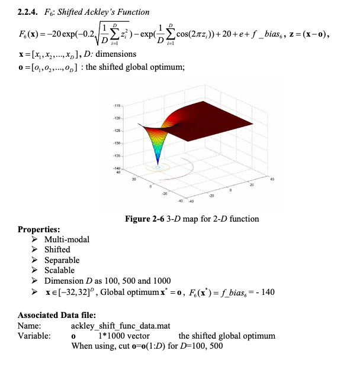
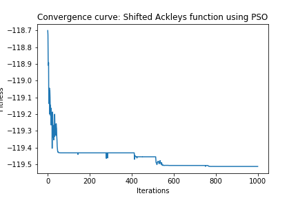
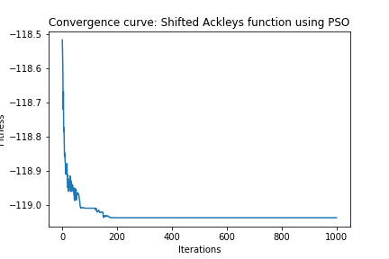

# Continuous optimization: Shifted Ackley's Function

## Definition of the Function

## Solution

I used the Particle Swarm Optimzation algorithm as in general it works well for continuous optimization problems and can search very large spaces of candidate solutions.

### Dimension 50

1. Chosen Algorithm: Particle Swarm Optimzation from pygmo

2. Parameters Tested
* Population (Particle Swarm size):  [50, 100, 200]
* Omega (inertia factor):  [0.2, 0.4, 0.6, 0.8]
* eta1 (social component):  [0.5, 1, 2, 3]
* eta2 (cognitive component):  [0.5, 1, 2, 3]
* Maximum allowed particle velocity:  [0.2, 0.4, 0.6, 0.8]

3. Best Parameters  
* Search Space = [-32, 32]  
* Bias = -140  
* Population (Particle Swarm size):  100
* Omega (inertia factor):  0.2
* eta1 (social component):  1
* eta2 (cognitive component):  1
* Maximum allowed particle velocity:  0.4
	
4. Results
* Solution: 
>  	[ 12.95052633 -10.79586083   4.22764779   2.22764774   5.19189644
      12.78036677   5.43778411   8.0688676   -1.06539927  -4.30099842
      -5.34037307  13.91376084   1.19927201   8.25156081  -8.32945597
     -14.74029179 -13.0837847   16.00151143   0.69964902   2.815603
      -6.56577744 -12.47240685  12.52809526   0.52660973  -2.32708881
      -5.1337654    9.4756861  -10.36454801  -1.69167188  -6.04577297
     -12.00229097  14.7293289   15.55725443  16.71530858  17.09928891
       4.80152417  -5.24749485 -10.61718915 -10.78972446  -4.39075849
       6.4304108   -5.64445523   1.06360828  10.37183994   6.90835268
      10.15076278  -3.47532516   3.34458981  -0.19517366  18.64547949]
* Fitness: -119.51

5. Stopping Criterion = Number of generations: 1000
6. Computational Time:  30.98  seconds
7. Convergence Curve

### Dimension 500

1. Chosen Algorithm: Particle Swarm Optimzation from pygmo

2. Parameters Tested
* Population (Particle Swarm size):  [50, 100, 200]
* Omega (inertia factor):  [0.2, 0.4, 0.6, 0.8]
* eta1 (social component):  [0.5, 1, 2, 3]
* eta2 (cognitive component):  [0.5, 1, 2, 3]
* Maximum allowed particle velocity:  [0.2, 0.4, 0.6, 0.8]

3. Best Parameters  
* Search Space = [-32, 32]  
* Bias = -140 
* Population (Particle Swarm size):  100
* Omega (inertia factor):  0.2
* eta1 (social component):  1
* eta2 (cognitive component):  1
* Maximum allowed particle velocity:  0.4
  
4. Results
* Solution: [solution_500](solution_500.csv)
* Fitness: -119.04

5. Stopping Criterion = Number of generations: 1000
6. Computational Time:  311.53  seconds
7. Convergence Curve

