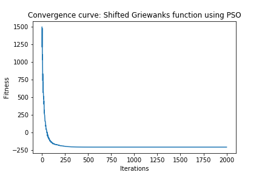
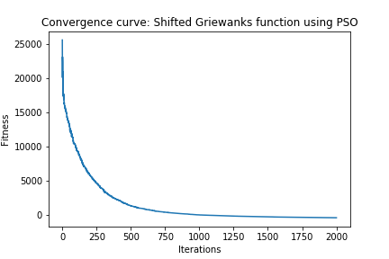

# Continuous optimization: Shifted Griewank's Function

## Definition of the Function

## Solution

I used the Particle Swarm Optimzation algorithm as in general it works well for continuous optimization problems and can search very large spaces of candidate solutions.

### Dimension 50

1. Chosen Algorithm: Particle Swarm Optimzation from pygmo

2. Parameters Tested
* Population (Particle Swarm size):  [50, 100, 200]
* Omega (inertia factor):  [0.2, 0.4, 0.6, 0.8]
* eta1 (social component):  [0.5, 1, 2, 3]
* eta2 (cognitive component):  [0.5, 1, 2, 3]
* Maximum allowed particle velocity:  [0.2, 0.4, 0.6, 0.8]

3. Best Parameters  
* Search Space = [-600, 600]  
* Bias = -180 
* Population (Particle Swarm size):  100
* Omega (inertia factor):  0.6
* eta1 (social component):  0.5
* eta2 (cognitive component):  3
* Maximum allowed particle velocity:  0.4
	
4. Results
* Solution: 
>  	[ 508.75491657 -322.63378364  182.54355245  -16.82103765  399.48597385
	  329.86076102 -118.50156729 -577.79562821  441.98363513  -26.81544124
	  138.51881769  415.23095803  573.69861423  239.15690154 -412.63408155
	 -113.1525444   573.93860431  526.70472614  -80.54586558  528.02010301
	 -559.02420882 -176.558241    435.37848639 -588.166439   -433.33094135
	 -356.681738   -425.95686358   91.7630921  -340.07404723 -361.42287839
	 -547.22276643  331.12523865 -101.39154239  518.17749377  -40.8067898
	  -60.58946629  452.98912668   30.18299536 -395.30935188  206.56496168
	  445.16384423 -576.43258365  257.86451133 -226.16216595  398.1552211
	   45.02885457  209.28273437  -42.82187511 -234.45915968 -372.41550312]
* Fitness: -211.28

5. Stopping Criterion = Number of generations: 2000
6. Computational Time:  61.21  seconds
7. Convergence Curve

### Dimension 500

1. Chosen Algorithm: Particle Swarm Optimzation from pygmo

2. Parameters Tested
* Population (Particle Swarm size):  [50, 100, 200]
* Omega (inertia factor):  [0.2, 0.4, 0.6, 0.8]
* eta1 (social component):  [0.5, 1, 2, 3]
* eta2 (cognitive component):  [0.5, 1, 2, 3]
* Maximum allowed particle velocity:  [0.2, 0.4, 0.6, 0.8]

3. Best Parameters  
* Search Space = [-600, 600]  
* Bias = -180   
* Population (Particle Swarm size):  200
* Omega (inertia factor):  0.6
* eta1 (social component):  1
* eta2 (cognitive component):  3
* Maximum allowed particle velocity:  0.4
	
4. Results
* Solution: [solution_500](solution_500.csv)

* Fitness: -407.22

5. Stopping Criterion = Number of generations: 2000
6. Computational Time:  774.16 seconds
7. Convergence Curve

