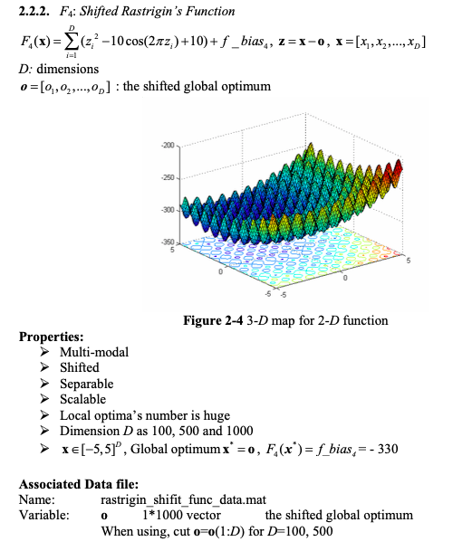
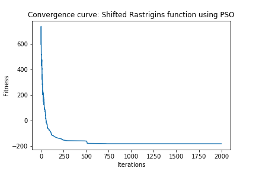
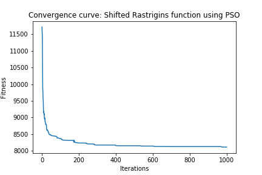

# Continuous optimization: Shifted Rastrigin's Function

## Definition of the Function

## Solution

I used the Particle Swarm Optimzation algorithm as in general it works well for continuous optimization problems and can search very large spaces of candidate solutions.

### Dimension 50

1. Chosen Algorithm: Particle Swarm Optimzation from pygmo

2. Parameters Tested
* Population (Particle Swarm size):  [50, 100, 200]
* Omega (inertia factor):  [0.2, 0.4, 0.6, 0.8]
* eta1 (social component):  [0.5, 1, 2, 3]
* eta2 (cognitive component):  [0.5, 1, 2, 3]
* Maximum allowed particle velocity:  [0.2, 0.4, 0.6, 0.8]

3. Best Parameters  
* Search Space = [-5, 5]  
* Bias = -330  
* Population (Particle Swarm size):  100
* Omega (inertia factor):  0.6
* eta1 (social component):  2
* eta2 (cognitive component):  2
* Maximum allowed particle velocity:  0.6
	
4. Results
* Solution: 
>  	[ 3.84659251  1.33876573 -0.83171862 -1.34337432  2.34828968  3.43582921
      0.52047536  4.32697074  1.99006422  3.29505408  4.3638418   1.23509789
     -1.0185341   2.63747139  3.61847769  1.98965337  1.61012995 -1.74049142
     -2.69746561  2.03050581 -4.19975238  2.81074511  2.29643824 -4.22400629
      2.42163854  0.71588757 -3.42694483 -0.49831761  1.73382315  2.17939323
     -3.27775921  0.79370037  3.59628567 -4.71920229 -0.47758587 -3.60435999
     -4.19894436  0.46834549 -2.03018617 -0.39848343 -1.78119476  2.97812111
      2.33153913  1.36477472 -3.87076635  1.84721301  2.20241866 -3.28001951
      2.68907274  0.08883828]
* Fitness: -187.75

5. Stopping Criterion = Number of generations: 2000
6. Computational Time:  45.26  seconds
7. Convergence Curve

### Dimension 500

1. Chosen Algorithm: Particle Swarm Optimzation from pygmo

2. Parameters Tested
* Population (Particle Swarm size):  [50, 100, 200]
* Omega (inertia factor):  [0.2, 0.4, 0.6, 0.8]
* eta1 (social component):  [0.5, 1, 2, 3]
* eta2 (cognitive component):  [0.5, 1, 2, 3]
* Maximum allowed particle velocity:  [0.2, 0.4, 0.6, 0.8]

3. Best Parameters  
* Search Space = [-5, 5]  
* Bias = -330   
* Population (Particle Swarm size):  200
* Omega (inertia factor):  0.4
* eta1 (social component):  1
* eta2 (cognitive component):  1
* Maximum allowed particle velocity:  0.8
  
4. Results
* Solution: [solution_500](solution_500.csv)
* Fitness: 8113.94

5. Stopping Criterion = Number of generations: 1000
6. Computational Time:  436.54  seconds
7. Convergence Curve

