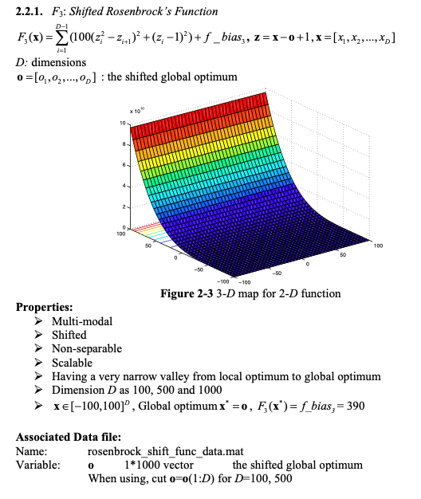
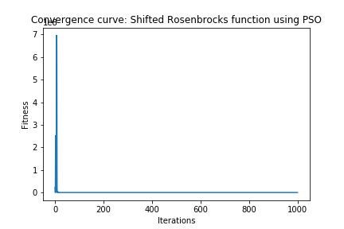
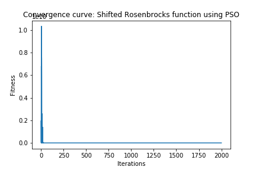

# Continuous optimization: Shifted Rosenbrock's Function

## Definition of the Function

## Solution

I used the Particle Swarm Optimzation algorithm as in general it works well for continuous optimization problems and can search very large spaces of candidate solutions.

### Dimension 50

1. Chosen Algorithm: Particle Swarm Optimzation from pygmo

2. Parameters Tested
* Population (Particle Swarm size):  [50, 100, 200]
* Omega (inertia factor):  [0.2, 0.4, 0.6, 0.8]
* eta1 (social component):  [0.5, 1, 2, 3]
* eta2 (cognitive component):  [0.5, 1, 2, 3]
* Maximum allowed particle velocity:  [0.2, 0.4, 0.6, 0.8]

3. Best Parameters  
* Search Space = [-100, 100]  
* Bias = 390  
* Population (Particle Swarm size):  100
* Omega (inertia factor):  0.2
* eta1 (social component):  0.5
* eta2 (cognitive component):  0.5
* Maximum allowed particle velocity:  0.2
	
4. Results
* Solution: 
>  	[-32.30589605  76.98588332 -20.64464619  24.32971679  15.64413599
     7.34543254  -3.41773987 -25.87697292  86.78815641 -19.82233573
    77.78926865 -68.01292077 -15.6124968  -39.64030618 -57.30750059
     6.76278454  29.15742336 -68.23556265  19.8998812  -46.25433927 
    -27.98369752 -60.88681179  35.6862432   59.75457283 -19.16759508
    -0.12571492   6.85747297 -69.63109476  60.37280354 -23.87988731
   -75.36498856   4.51538476  52.77226306  58.69726095   3.83487608
   -74.90971532  64.36029806  12.13798656  30.02893308  33.7483257
    27.82472768 -46.27358159  34.86923739   8.88976878 -10.73438498
   -29.84506193  -7.69072179 -22.6839387   25.02580945 -81.92358408]
* Fitness: 390.0

5. Stopping Criterion = Number of generations: 1000
6. Computational Time:  35.82  seconds
7. Convergence Curve

### Dimension 500

1. Chosen Algorithm: Particle Swarm Optimzation from pygmo

2. Parameters Tested
* Population (Particle Swarm size):  [50, 100, 200]
* Omega (inertia factor):  [0.2, 0.4, 0.6, 0.8]
* eta1 (social component):  [0.5, 1, 2, 3]
* eta2 (cognitive component):  [0.5, 1, 2, 3]
* Maximum allowed particle velocity:  [0.2, 0.4, 0.6, 0.8]

3. Best Parameters  
* Search Space = [-100, 100]  
* Bias = 390  
* Population (Particle Swarm size):  100
* Omega (inertia factor):  0.2
* eta1 (social component):  0.6
* eta2 (cognitive component):  0.6
* Maximum allowed particle velocity:  0.4
  
4. Results
* Solution: 
* Fitness: 390.0

5. Stopping Criterion = Number of generations: 2000
6. Computational Time:  385.49  seconds
7. Convergence Curve

